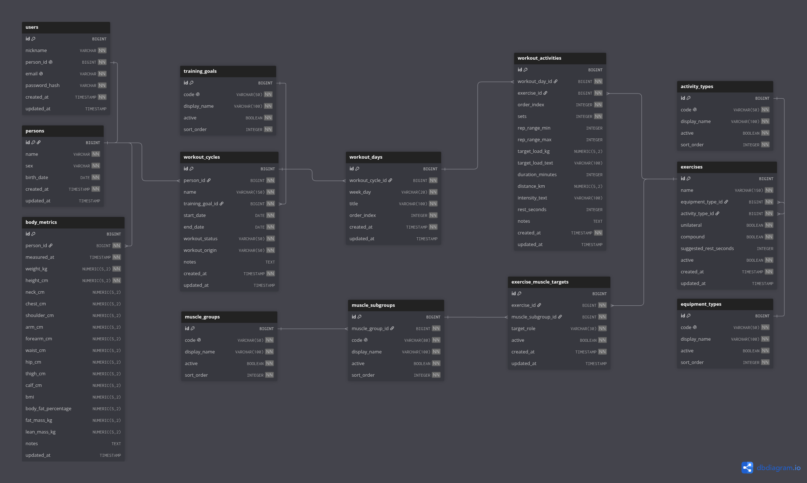

# Diagrama Entidade-Relacionamento (ER)

<p align="center">
    
</p>

## Visão Geral

Este documento descreve o modelo relacional atual e planejado da aplicação **IronCore**.

O diagrama representa duas camadas de leitura:

- **implementado**: tabelas existentes nas migrations Flyway atuais;
- **blueprint**: tabelas planejadas para módulos futuros, ainda sem migration funcional.

A posição visual das tabelas na imagem prioriza legibilidade e não representa prioridade funcional, criticidade técnica ou ordem de entrega.

## Leitura Rapida do Domínio

Modelo implementado:

- `persons`: dados pessoais.
- `users`: autenticação/acesso, com referencia para `persons`.
- `body_metrics`: histórico de medições corporais da pessoa.
- `audit_logs`: registros persistidos de auditoria.
- `error_logs`: registros técnicos de erro.

Modelo planejado no diagrama:

- `muscle_groups`, `muscle_subgroups`, `equipment_types`, `activity_types` e `training_goals`: tabelas de domínio e classificação.
- `exercises`: catálogo de exercícios.
- `exercise_muscle_targets`: associação entre exercícios e subgrupos musculares.
- `workout_cycles`: ciclos ou planos de treino da pessoa.
- `workout_days`: divisão semanal do ciclo.
- `workout_activities`: atividades prescritas em cada dia de treino.

## Decisão Estrutural Principal

O modelo atual separa dados pessoais, conta de acesso e medições corporais:

```text
Person = dados pessoais
User = autenticação/acesso
BodyMetrics = métricas corporais da pessoa
```

Consequências:

- `users.person_id` referencia `persons.id`.
- `body_metrics.person_id` referencia `persons.id`.
- A API pode continuar partindo do usuário autenticado.
- A ownership interna de dados físicos passa a ser baseada em `PersonId`.

## Tabelas Implementadas

### `persons`

Armazena os dados pessoais vinculados ao usuário e aos dados corporais.

| Campo | Tipo | Obrigatório | Descricao |
|---|---|---|---|
| `id` | `BIGINT` | Sim | Identificador único da pessoa. |
| `name` | `VARCHAR` | Sim | Nome da pessoa. Não possui unicidade. |
| `sex` | `VARCHAR` | Sim | Sexo usado em regras corporais, como cálculo Navy. |
| `birth_date` | `DATE` | Sim | Data de nascimento. |
| `created_at` | `TIMESTAMP` | Sim | Data e hora de criação do registro. |
| `updated_at` | `TIMESTAMP` | Não | Data e hora da última atualização. |

### `users`

Armazena credenciais, identificação de conta e estado técnico de acesso.

| Campo | Tipo | Obrigatório | Descricao |
|---|---|---|---|
| `id` | `BIGINT` | Sim | Identificador único do usuário. |
| `nickname` | `VARCHAR` | Sim | Nome de exibição/conta. |
| `person_id` | `BIGINT` | Sim | Pessoa vinculada ao usuário. |
| `email` | `VARCHAR` | Sim | E-mail único para autenticação. |
| `password_hash` | `VARCHAR` | Sim | Hash da senha do usuário. |
| `must_change_password` | `BOOLEAN` | Sim | Indica troca obrigatória de senha inicial. |
| `active` | `BOOLEAN` | Sim | Status técnico de acesso. |
| `created_at` | `TIMESTAMP` | Sim | Data e hora de criação do registro. |
| `updated_at` | `TIMESTAMP` | Não | Data e hora da última atualização. |

### `body_metrics`

Registra o histórico de medições corporais de cada pessoa.

| Campo | Tipo | Obrigatório | Descricao |
|---|---|---|---|
| `id` | `BIGINT` | Sim | Identificador único da medição. |
| `person_id` | `BIGINT` | Sim | Pessoa dona da medição. |
| `measured_at` | `TIMESTAMP` | Sim | Data e hora em que a medição foi registrada. |
| `weight_kg` | `DOUBLE PRECISION` | Sim | Peso corporal em quilogramas. |
| `height_cm` | `DOUBLE PRECISION` | Sim | Altura em centímetros. |
| `neck_cm` | `DOUBLE PRECISION` | Não | Medida do pescoço em centímetros. |
| `chest_cm` | `DOUBLE PRECISION` | Não | Medida do tórax em centímetros. |
| `shoulder_cm` | `DOUBLE PRECISION` | Não | Medida do ombro em centímetros. |
| `arm_cm` | `DOUBLE PRECISION` | Não | Medida do braço em centímetros. |
| `forearm_cm` | `DOUBLE PRECISION` | Não | Medida do antebraço em centímetros. |
| `waist_cm` | `DOUBLE PRECISION` | Não | Medida da cintura em centímetros. |
| `hip_cm` | `DOUBLE PRECISION` | Não | Medida do quadril em centímetros. |
| `thigh_cm` | `DOUBLE PRECISION` | Não | Medida da coxa em centímetros. |
| `calf_cm` | `DOUBLE PRECISION` | Não | Medida da panturrilha em centímetros. |
| `bmi` | `DOUBLE PRECISION` | Não | Índice de Massa Corporal. |
| `body_fat_percentage` | `DOUBLE PRECISION` | Não | Percentual de gordura corporal. |
| `fat_mass_kg` | `DOUBLE PRECISION` | Não | Massa gorda em quilogramas. |
| `lean_mass_kg` | `DOUBLE PRECISION` | Não | Massa magra em quilogramas. |
| `updated_at` | `TIMESTAMP` | Não | Data e hora da última atualização. |
| `notes` | `TEXT` | Não | Observações livres sobre a medição. |

### `audit_logs`

Armazena registros de auditoria de ações relevantes.

A tabela existe nas migrations atuais e é documentada em [Audit Log](../../logging/audit-log.md).

### `error_logs`

Armazena registros técnicos de erro.

A tabela existe nas migrations atuais e é documentada em [Error Log](../../logging/error-log.md).

## Tabelas Planejadas no Diagrama

As tabelas abaixo aparecem no diagrama como blueprint de produto. Elas não devem ser tratadas como schema implementado enquanto não existirem migrations correspondentes.

### `muscle_groups`

Classifica grupamentos musculares principais.

Campos planejados:

- `id`
- `code`
- `display_name`
- `active`
- `sort_order`

### `muscle_subgroups`

Classifica subgrupos musculares vinculados a um grupamento principal.

Campos planejados:

- `id`
- `muscle_group_id`
- `code`
- `display_name`
- `active`
- `sort_order`

### `equipment_types`

Classifica o tipo de equipamento exigido no exercício.

Campos planejados:

- `id`
- `code`
- `display_name`
- `active`
- `sort_order`

### `activity_types`

Classifica a natureza da atividade física.

Campos planejados:

- `id`
- `code`
- `display_name`
- `active`
- `sort_order`

### `training_goals`

Representa o objetivo principal do ciclo de treino.

Campos planejados:

- `id`
- `code`
- `display_name`
- `active`
- `sort_order`

### `exercises`

Catalogo central de exercícios disponíveis para composição dos treinos.

Campos planejados:

- `id`
- `name`
- `equipment_type_id`
- `activity_type_id`
- `unilateral`
- `compound`
- `suggested_rest_seconds`
- `active`
- `created_at`
- `updated_at`

### `exercise_muscle_targets`

Associa exercícios a subgrupos musculares e permite diferenciar papel principal/secundário do alvo muscular.

Campos planejados:

- `id`
- `exercise_id`
- `muscle_subgroup_id`
- `target_role`
- `active`
- `created_at`
- `updated_at`

### `workout_cycles`

Representa um ciclo de treino associado a uma pessoa e a um objetivo específico.

Campos planejados:

- `id`
- `person_id`
- `name`
- `training_goal_id`
- `start_date`
- `end_date`
- `workout_status`
- `workout_origin`
- `notes`
- `created_at`
- `updated_at`

### `workout_days`

Organiza os dias de treino vinculados a um ciclo.

Campos planejados:

- `id`
- `workout_cycle_id`
- `week_day`
- `title`
- `order_index`
- `created_at`
- `updated_at`

### `workout_activities`

Detalha cada atividade prescrita dentro de um dia de treino.

Campos planejados:

- `id`
- `workout_day_id`
- `exercise_id`
- `order_index`
- `sets`
- `rep_range_min`
- `rep_range_max`
- `target_load_kg`
- `target_load_text`
- `duration_minutes`
- `distance_km`
- `intensity_text`
- `rest_seconds`
- `notes`
- `created_at`
- `updated_at`

## Relacionamentos

Relacionamentos implementados:

- `persons` 1:1 `users`
- `persons` 1:N `body_metrics`

Relacionamentos planejados no diagrama:

- `persons` 1:N `workout_cycles`
- `training_goals` 1:N `workout_cycles`
- `workout_cycles` 1:N `workout_days`
- `workout_days` 1:N `workout_activities`
- `exercises` 1:N `workout_activities`
- `equipment_types` 1:N `exercises`
- `activity_types` 1:N `exercises`
- `muscle_groups` 1:N `muscle_subgroups`
- `muscle_subgroups` 1:N `exercise_muscle_targets`
- `exercises` 1:N `exercise_muscle_targets`

## Fluxo Logico do Domínio

De forma resumida, o fluxo planejado funciona assim:

1. uma `person` possui dados pessoais;
2. um `user` referencia uma `person` para autenticar e acessar o sistema;
3. `body_metrics` registra medições corporais da `person`;
4. a mesma `person` poderá possuir varios `workout_cycles`;
5. cada `workout_cycle` será criado com base em um `training_goal`;
6. cada ciclo será dividido em varios `workout_days`;
7. cada dia contera varias `workout_activities`;
8. cada atividade apontará para um item do catálogo `exercises`;
9. cada exercício será classificado por equipamento, tipo de atividade e alvos musculares.

## Observações de Modelagem

- `Person` é a base de dados pessoais.
- `User` é a conta de autenticação/acesso.
- `BodyMetrics` pertence a `PersonId`.
- `users.person_id` é único no modelo atual.
- `body_metrics.person_id` permite histórico N:1 de medições corporais por pessoa.
- A imagem deste diagrama foi criada com o [dbdiagram.io](https://dbdiagram.io/).

<p align="right"><a href="../../../README.md">Voltar para a documentação completa</a></p>
